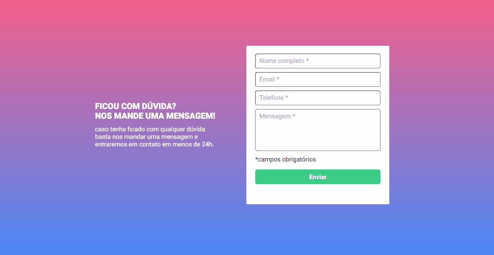

# Formulário com validação

Desafio proposto no curso DevQuest. Um formulário que só permite enviar, se as informações estão completas. 
Verificando se todos os campos obrigatórios estão devidamente preenchidos, sendo assim uma borda verde é mostrada. 
Caso estejam vazios a borda do campo é mostrada em destaque na cor vermelha, juntamente com um aviso. 
 

[]

## Meu processo

### Tecnologias utilizadas

- HTML
- CSS
- JavaScript

### O que aprendi

No desenvolvimento deste formulário, posso dizer que mesmo com erros durante o processo, foi fácil entender o poder da utilização de JavaScript, CSS e HTML juntos. Com destaque para JS, fazendo toda a "mágica" de validar cada input e mudando sua aparência de acordo. 
